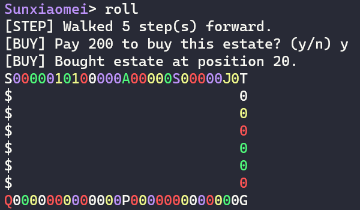

# monopoly-c

A rewrite of [npurson/monopoly](https://github.com/npurson/monopoly) in C on UNIX.

Try out by running `./autoplay.sh`.



## Build

```
make
```

## Debug

Upon game start, enter command `preset option debug on` to toggle debugging output.

Or build debug target to enable debugging messages by default:

```
make debug
```

## Test

```
pushd test
pip install -r requirements.txt -i https://pypi.tuna.tsinghua.edu.cn/simple
popd
make test
```
